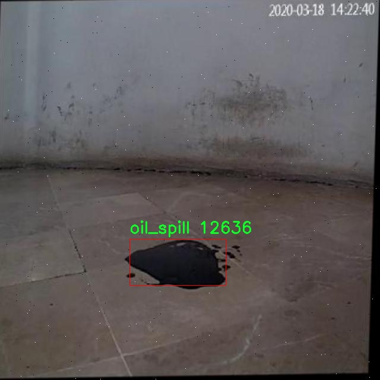

# 油污检测检测系统源码分享
 # [一条龙教学YOLOV8标注好的数据集一键训练_70+全套改进创新点发刊_Web前端展示]

### 1.研究背景与意义

项目参考[AAAI Association for the Advancement of Artificial Intelligence](https://gitee.com/qunmasj/projects)

项目来源[AACV Association for the Advancement of Computer Vision](https://kdocs.cn/l/cszuIiCKVNis)

研究背景与意义

随着全球经济的快速发展，石油作为重要的能源资源，其开采和运输过程中不可避免地会发生油污泄漏事件。这些油污不仅对生态环境造成了严重的污染，还对海洋生物的生存和人类的健康构成了威胁。因此，及时、准确地检测和监测油污泄漏现象显得尤为重要。传统的油污检测方法多依赖人工观察和取样分析，效率低下且容易受到人为因素的影响，难以满足现代社会对环境保护的高要求。因此，基于计算机视觉和深度学习技术的自动化油污检测系统应运而生，成为解决这一问题的有效手段。

YOLO（You Only Look Once）系列模型因其高效的实时目标检测能力而广泛应用于各类物体检测任务。YOLOv8作为该系列的最新版本，具备更强的特征提取能力和更快的推理速度，能够在复杂环境中实现对目标的精准识别。然而，针对油污检测这一特定任务，YOLOv8的原始模型可能无法充分发挥其潜力。因此，改进YOLOv8模型以适应油污检测的需求，成为了本研究的核心目标。

本研究将基于一个包含2200张油污图像的数据集进行模型训练和测试。该数据集专门针对油污这一特定类别进行标注，确保了数据的准确性和有效性。通过对数据集的深入分析，我们可以发现油污在不同环境、不同光照条件下的表现差异，这为模型的改进提供了重要的依据。利用这一数据集，我们将对YOLOv8进行改进，优化其网络结构和训练策略，以提高其在油污检测任务中的性能。

研究的意义不仅体现在技术层面，更在于其对环境保护和生态安全的积极影响。通过构建一个高效的油污检测系统，我们能够实现对油污泄漏事件的快速响应，及时采取措施进行清理和修复，从而减少对生态环境的损害。此外，该系统的推广应用还将为相关行业提供技术支持，推动油气行业在环境保护方面的责任落实，促进可持续发展。

综上所述，基于改进YOLOv8的油污检测系统的研究，不仅具有重要的学术价值，也为实际应用提供了切实可行的解决方案。通过这一研究，我们期望能够为油污检测领域的发展贡献新的思路和方法，推动智能监测技术在环境保护中的应用，为实现绿色发展目标助力。

### 2.图片演示


##### 注意：由于此博客编辑较早，上面“2.图片演示”和“3.视频演示”展示的系统图片或者视频可能为老版本，新版本在老版本的基础上升级如下：（实际效果以升级的新版本为准）

  （1）适配了YOLOV8的“目标检测”模型和“实例分割”模型，通过加载相应的权重（.pt）文件即可自适应加载模型。

  （2）支持“图片识别”、“视频识别”、“摄像头实时识别”三种识别模式。

  （3）支持“图片识别”、“视频识别”、“摄像头实时识别”三种识别结果保存导出，解决手动导出（容易卡顿出现爆内存）存在的问题，识别完自动保存结果并导出到tempDir中。

  （4）支持Web前端系统中的标题、背景图等自定义修改，后面提供修改教程。

  另外本项目提供训练的数据集和训练教程,暂不提供权重文件（best.pt）,需要您按照教程进行训练后实现图片演示和Web前端界面演示的效果。

### 3.视频演示

[3.1 视频演示](https://www.bilibili.com/video/BV171skezEYy/)

### 4.数据集信息展示

##### 4.1 本项目数据集详细数据（类别数＆类别名）

nc: 1
names: ['oil_spill']


##### 4.2 本项目数据集信息介绍

数据集信息展示

在本研究中，我们使用了名为“oil_spill”的数据集，旨在训练和改进YOLOv8模型，以实现高效的油污检测系统。该数据集专注于单一类别的油污检测，具有独特的应用价值，尤其是在环境监测和海洋保护领域。油污的及时检测与处理对于防止生态系统的进一步恶化至关重要，因此构建一个高效的检测系统显得尤为重要。

“oil_spill”数据集的类别数量为1，具体类别为“oil_spill”。这一单一类别的设计使得数据集在特定任务上的表现更加集中，能够有效地帮助模型学习油污的特征与表现形式。油污的种类繁多，可能包括石油泄漏、油漆污染等多种形式，但本数据集专注于油污这一特定类别，使得模型在该领域的学习更加深入和精确。

数据集的构建过程经过精心设计，确保了样本的多样性和代表性。数据集中包含了大量的图像，涵盖了不同环境、不同光照条件和不同油污状态下的油污样本。这种多样性不仅提高了模型的泛化能力，也增强了其在实际应用中的鲁棒性。通过在各种场景下的训练，YOLOv8模型能够更好地适应不同的油污检测任务，无论是在海洋、河流还是其他水体中。

在数据集的标注过程中，采用了高标准的标注规范，确保每一张图像中的油污区域都被准确标记。这一过程不仅需要专业的知识背景，还需要细致的观察力，以确保标注的准确性和一致性。通过这种精细化的标注，模型能够更有效地学习到油污的形状、颜色和纹理等特征，从而在检测时实现更高的准确率。

此外，为了提高模型的训练效率和效果，数据集还进行了数据增强处理。这包括旋转、缩放、裁剪、颜色变换等多种方式，以增加训练样本的多样性和数量。这种数据增强策略能够有效地减少模型的过拟合现象，使得模型在面对未见过的油污样本时，依然能够保持良好的检测性能。

总之，“oil_spill”数据集为改进YOLOv8的油污检测系统提供了坚实的基础。通过专注于油污这一特定类别，并结合多样化的样本和高质量的标注，数据集不仅提升了模型的学习能力，也为后续的油污监测和环境保护工作提供了重要的技术支持。随着油污检测技术的不断进步，我们期待该系统能够在实际应用中发挥更大的作用，为保护海洋生态环境贡献力量。




### 5.全套项目环境部署视频教程（零基础手把手教学）

[5.1 环境部署教程链接（零基础手把手教学）](https://www.ixigua.com/7404473917358506534?logTag=c807d0cbc21c0ef59de5)


[5.2 安装Python虚拟环境创建和依赖库安装视频教程链接（零基础手把手教学）](https://www.ixigua.com/7404474678003106304?logTag=1f1041108cd1f708b01a)

### 6.手把手YOLOV8训练视频教程（零基础小白有手就能学会）

[6.1 手把手YOLOV8训练视频教程（零基础小白有手就能学会）](https://www.ixigua.com/7404477157818401292?logTag=d31a2dfd1983c9668658)

### 7.70+种全套YOLOV8创新点代码加载调参视频教程（一键加载写好的改进模型的配置文件）

[7.1 70+种全套YOLOV8创新点代码加载调参视频教程（一键加载写好的改进模型的配置文件）](https://www.ixigua.com/7404478314661806627?logTag=29066f8288e3f4eea3a4)

### 8.70+种全套YOLOV8创新点原理讲解（非科班也可以轻松写刊发刊，V10版本正在科研待更新）

由于篇幅限制，每个创新点的具体原理讲解就不一一展开，具体见下列网址中的创新点对应子项目的技术原理博客网址【Blog】：


[8.1 70+种全套YOLOV8创新点原理讲解链接](https://gitee.com/qunmasj/good)

### 9.系统功能展示（检测对象为举例，实际内容以本项目数据集为准）

图9.1.系统支持检测结果表格显示

  图9.2.系统支持置信度和IOU阈值手动调节

  图9.3.系统支持自定义加载权重文件best.pt(需要你通过步骤5中训练获得)

  图9.4.系统支持摄像头实时识别

  图9.5.系统支持图片识别

  图9.6.系统支持视频识别

  图9.7.系统支持识别结果文件自动保存

  图9.8.系统支持Excel导出检测结果数据


### 10.原始YOLOV8算法原理

原始YOLOv8算法原理

YOLOv8算法是目标检测领域的一项重要进展，继承了YOLO系列的传统，同时引入了一系列创新，旨在提高检测精度和效率。作为一种一阶段目标检测算法，YOLOv8将目标检测任务转化为回归问题，通过单一的神经网络模型实现目标的位置和类别的同时预测。与前几代YOLO模型相比，YOLOv8在训练时间和检测精度上都得到了显著提升，且其模型权重文件经过轻量化处理，使得其能够在嵌入式设备上高效运行，满足实时检测的需求。

YOLOv8的网络结构由三个主要部分组成：主干网络（backbone）、特征增强网络（neck）和检测头（head）。主干网络依然采用了CSP（Cross Stage Partial）结构的思想，旨在提高特征提取的效率和准确性。在此基础上，YOLOv8引入了C2f模块替代了之前的C3模块。C2f模块通过增加跳层连接，丰富了梯度流信息，使得模型在训练过程中能够更好地学习到有用的特征，同时保持了模型的轻量化特性。这样的设计不仅提升了模型的表现，也在一定程度上降低了计算复杂度，确保了实时检测的可行性。

在特征增强网络方面，YOLOv8采用了PAN-FPN（Path Aggregation Network - Feature Pyramid Network）的结构。这种结构通过多尺度特征融合，确保了不同尺度目标的有效检测。PAN-FPN的设计理念在于充分利用特征金字塔中的信息，使得网络能够在不同层次上进行特征的整合与优化，从而提升模型对各种目标的检测能力。

检测头部分是YOLOv8的一大创新点。YOLOv8采用了解耦头（Decoupled Head）结构，将分类和回归任务分为两个独立的分支。这样的设计使得模型在处理复杂场景时，能够更专注于各自的任务，减少了定位不准和分类错误的问题。分类任务更关注特征图中与已知类别的相似性，而定位任务则更关注边界框与真实框之间的关系。通过解耦，YOLOv8能够更快地收敛，提高预测的精度。

YOLOv8还引入了Anchor-free目标检测方法，这是一种基于回归的目标检测策略。传统的目标检测方法通常依赖于预定义的锚点框，这种方法在选择和调整锚点框时存在一定的复杂性和局限性。YOLOv8的Anchor-free方法直接预测目标的位置和大小，省去了锚点框的设置，使得网络能够更快速地聚焦于目标的实际位置。这种设计使得YOLOv8在处理不同尺度和形状的目标时表现得更加灵活和高效。

在数据预处理方面，YOLOv8延续了YOLOv5的策略，采用了多种数据增强技术，如马赛克增强、混合增强、空间扰动和颜色扰动等。这些增强手段旨在提升模型的鲁棒性和泛化能力，确保模型在面对不同环境和条件时依然能够保持良好的检测性能。值得注意的是，YOLOv8在训练的最后阶段停止使用马赛克数据增强，以避免对数据真实分布的破坏，从而使模型能够更好地学习到真实的特征。

在标签分配策略上，YOLOv8采用了TOOD（Task-Oriented Object Detection）策略，这是一种动态标签分配方法。与之前的YOLO系列相比，YOLOv8不再依赖于候选框的聚类，而是通过正负样本的多尺度分配来优化标签的匹配。YOLOv8的损失函数主要包括类别损失和位置损失，其中类别损失采用了变焦损失（Varifocal Loss），而回归损失则结合了CIoU（Complete Intersection over Union）损失和DFL（Distribution Focal Loss）损失。这种损失设计使得模型在训练过程中能够更好地关注高质量的正样本，同时降低负样本对损失的影响，从而提升模型的整体性能。

综上所述，YOLOv8在网络结构、数据处理、标签分配等多个方面进行了创新和改进，使得其在目标检测任务中表现出色。通过引入解耦头和Anchor-free策略，YOLOv8能够更高效地处理复杂场景下的目标检测问题，展现出更强的实时性和准确性。这些改进不仅提升了YOLOv8的性能，也为未来的目标检测研究提供了新的思路和方向。随着YOLOv8的不断发展和应用，其在各类实际场景中的潜力将得到进一步的挖掘，推动目标检测技术的进步与普及。


### 11.项目核心源码讲解（再也不用担心看不懂代码逻辑）

#### 11.1 ui.py

以下是经过简化和注释的核心代码：

```python
import sys
import subprocess

def run_script(script_path):
    """
    使用当前 Python 环境运行指定的脚本。

    Args:
        script_path (str): 要运行的脚本路径
    """
    # 获取当前 Python 解释器的路径
    python_path = sys.executable

    # 构建运行命令，使用 streamlit 运行指定的脚本
    command = f'"{python_path}" -m streamlit run "{script_path}"'

    # 执行命令并等待其完成
    result = subprocess.run(command, shell=True)
    
    # 检查命令执行结果，如果返回码不为0，表示出错
    if result.returncode != 0:
        print("脚本运行出错。")

# 程序入口
if __name__ == "__main__":
    # 指定要运行的脚本路径
    script_path = "web.py"  # 这里可以直接指定脚本名

    # 调用函数运行脚本
    run_script(script_path)
```

### 代码注释说明：
1. **导入模块**：
   - `sys`：用于获取当前 Python 解释器的路径。
   - `subprocess`：用于执行外部命令。

2. **`run_script` 函数**：
   - 该函数接受一个脚本路径作为参数，并使用当前 Python 环境运行该脚本。
   - 使用 `sys.executable` 获取当前 Python 解释器的路径。
   - 构建命令字符串，使用 `streamlit` 运行指定的脚本。
   - 使用 `subprocess.run` 执行命令，并检查返回码以判断脚本是否成功运行。

3. **程序入口**：
   - 在 `if __name__ == "__main__":` 块中，指定要运行的脚本路径，并调用 `run_script` 函数。

这个程序文件 `ui.py` 的主要功能是通过当前的 Python 环境来运行一个指定的脚本，具体来说是一个名为 `web.py` 的脚本。文件中首先导入了一些必要的模块，包括 `sys`、`os` 和 `subprocess`，以及一个自定义的函数 `abs_path`，它可能用于获取文件的绝对路径。

在 `run_script` 函数中，首先获取当前 Python 解释器的路径，这样可以确保在正确的环境中运行脚本。接着，构建一个命令字符串，该命令使用 `streamlit` 模块来运行指定的脚本。`streamlit` 是一个用于构建数据应用的库，通常用于快速开发 Web 应用。

然后，使用 `subprocess.run` 方法来执行这个命令。这个方法会在新的子进程中运行命令，并等待其完成。如果命令执行返回的状态码不为零，表示脚本运行过程中出现了错误，此时会打印出一条错误信息。

在文件的最后部分，使用 `if __name__ == "__main__":` 语句来确保当该文件作为主程序运行时，才会执行后面的代码。这里指定了要运行的脚本路径为 `web.py`，并调用 `run_script` 函数来执行它。

总的来说，这个文件的功能是封装了一个简单的接口，用于在当前 Python 环境中运行一个 Streamlit 应用脚本，方便用户进行 Web 应用的开发和测试。

#### 11.2 code\ultralytics\models\utils\ops.py

以下是经过简化和注释的核心代码部分，主要集中在 `HungarianMatcher` 类的实现上：

```python
import torch
import torch.nn as nn
import torch.nn.functional as F
from scipy.optimize import linear_sum_assignment
from ultralytics.utils.metrics import bbox_iou

class HungarianMatcher(nn.Module):
    """
    实现匈牙利匹配算法的模块，用于解决预测框与真实框之间的最优匹配问题。
    匈牙利匹配算法通过计算代价矩阵来进行匹配，代价矩阵考虑了分类分数、边界框坐标等因素。
    """

    def __init__(self, cost_gain=None, use_fl=True, with_mask=False):
        """初始化 HungarianMatcher，设置代价系数和其他参数。"""
        super().__init__()
        if cost_gain is None:
            cost_gain = {"class": 1, "bbox": 5, "giou": 2}
        self.cost_gain = cost_gain  # 代价系数
        self.use_fl = use_fl  # 是否使用焦点损失
        self.with_mask = with_mask  # 是否考虑掩码预测

    def forward(self, pred_bboxes, pred_scores, gt_bboxes, gt_cls, gt_groups):
        """
        前向传播，计算预测框与真实框之间的匹配。
        
        参数:
            pred_bboxes (Tensor): 预测的边界框，形状为 [batch_size, num_queries, 4]。
            pred_scores (Tensor): 预测的分类分数，形状为 [batch_size, num_queries, num_classes]。
            gt_bboxes (Tensor): 真实的边界框，形状为 [num_gts, 4]。
            gt_cls (Tensor): 真实的类别，形状为 [num_gts, ]。
            gt_groups (List[int]): 每个图像的真实框数量。

        返回:
            List[Tuple[Tensor, Tensor]]: 每个批次的匹配结果，包含预测框和真实框的索引。
        """
        bs, nq, nc = pred_scores.shape  # 获取批次大小、查询数量和类别数量

        # 如果没有真实框，返回空匹配
        if sum(gt_groups) == 0:
            return [(torch.tensor([], dtype=torch.long), torch.tensor([], dtype=torch.long)) for _ in range(bs)]

        # 扁平化处理以计算代价矩阵
        pred_scores = pred_scores.detach().view(-1, nc)
        pred_scores = F.sigmoid(pred_scores) if self.use_fl else F.softmax(pred_scores, dim=-1)
        pred_bboxes = pred_bboxes.detach().view(-1, 4)

        # 计算分类代价
        pred_scores = pred_scores[:, gt_cls]
        cost_class = -pred_scores  # 分类代价为负分数

        # 计算边界框的L1代价
        cost_bbox = (pred_bboxes.unsqueeze(1) - gt_bboxes.unsqueeze(0)).abs().sum(-1)

        # 计算GIoU代价
        cost_giou = 1.0 - bbox_iou(pred_bboxes.unsqueeze(1), gt_bboxes.unsqueeze(0), xywh=True, GIoU=True).squeeze(-1)

        # 组合最终的代价矩阵
        C = (
            self.cost_gain["class"] * cost_class
            + self.cost_gain["bbox"] * cost_bbox
            + self.cost_gain["giou"] * cost_giou
        )

        # 将无效值（NaN和无穷大）设置为0
        C[C.isnan() | C.isinf()] = 0.0

        C = C.view(bs, nq, -1).cpu()  # 重新调整形状以适应批次
        indices = [linear_sum_assignment(c[i]) for i, c in enumerate(C.split(gt_groups, -1))]  # 进行匈牙利匹配
        gt_groups = torch.as_tensor([0, *gt_groups[:-1]]).cumsum_(0)  # 计算真实框的索引
        return [
            (torch.tensor(i, dtype=torch.long), torch.tensor(j, dtype=torch.long) + gt_groups[k])
            for k, (i, j) in enumerate(indices)
        ]
```

### 代码注释说明：
1. **类定义**：`HungarianMatcher` 类实现了匈牙利算法，用于在预测框和真实框之间进行最优匹配。
2. **初始化方法**：设置代价系数和其他参数，默认的代价系数为分类、边界框和GIoU。
3. **前向传播方法**：计算预测框与真实框之间的匹配，主要步骤包括：
   - 扁平化预测分数和边界框以便计算。
   - 计算分类代价、L1代价和GIoU代价。
   - 组合这些代价形成最终的代价矩阵。
   - 使用匈牙利算法进行匹配，并返回匹配结果。

这个简化版本保留了核心逻辑，并提供了详细的中文注释，便于理解每个部分的功能。

这个程序文件定义了一个名为 `HungarianMatcher` 的类，主要用于解决目标检测中的分配问题。它通过匈牙利算法在预测的边界框和真实的边界框之间进行最优匹配。该类继承自 `torch.nn.Module`，实现了一个可微分的模块，能够在端到端的训练过程中使用。

在初始化方法中，`HungarianMatcher` 接受多个参数，包括成本系数、是否使用焦点损失、是否进行掩码预测、样本点数量以及焦点损失的超参数（alpha 和 gamma）。如果没有提供成本系数，默认值会被设置为一个字典，包含分类、边界框、广义交并比（GIoU）、掩码和 Dice 系数的权重。

`forward` 方法是该类的核心功能，接受预测的边界框、分数、真实的边界框、类别和组信息等参数。它首先检查每个批次的真实目标数量，如果没有目标，则返回空的索引。接着，方法将预测的分数和边界框展平，以便计算成本矩阵。分类成本通过焦点损失或普通的交叉熵计算，边界框的 L1 成本通过计算预测框与真实框之间的绝对差值得到，而 GIoU 成本则通过调用 `bbox_iou` 函数计算。

最终，所有成本被加权合并成一个成本矩阵。若模型进行掩码预测，还会调用 `_cost_mask` 方法计算掩码成本。无效值（如 NaN 和无穷大）会被设置为 0。通过 `linear_sum_assignment` 函数，计算出最佳匹配的索引，并返回每个批次的匹配结果。

此外，文件中还定义了一个 `get_cdn_group` 函数，用于生成对比去噪训练组。该函数从真实目标中创建正负样本，并对类别标签和边界框坐标施加噪声。它返回修改后的类别嵌入、边界框、注意力掩码和元信息。如果不在训练模式或去噪数量小于等于 0，则返回 None。

整体而言，这个文件的功能是为目标检测模型提供一种有效的匹配机制，以便在训练过程中优化预测结果。

#### 11.3 code\ultralytics\data\augment.py

以下是代码中最核心的部分，并附上详细的中文注释：

```python
class BaseTransform:
    """
    图像变换的基类。

    这个通用的变换类可以扩展以满足特定的图像处理需求。
    该类旨在与分类和语义分割任务兼容。

    方法：
        __init__: 初始化 BaseTransform 对象。
        apply_image: 对标签应用图像变换。
        apply_instances: 对标签中的对象实例应用变换。
        apply_semantic: 对图像应用语义分割。
        __call__: 对图像、实例和语义掩码应用所有标签变换。
    """

    def __init__(self) -> None:
        """初始化 BaseTransform 对象。"""
        pass

    def apply_image(self, labels):
        """对标签应用图像变换。"""
        pass

    def apply_instances(self, labels):
        """对标签中的对象实例应用变换。"""
        pass

    def apply_semantic(self, labels):
        """对图像应用语义分割。"""
        pass

    def __call__(self, labels):
        """对图像、实例和语义掩码应用所有标签变换。"""
        self.apply_image(labels)
        self.apply_instances(labels)
        self.apply_semantic(labels)


class Mosaic(BaseMixTransform):
    """
    Mosaic 增强。

    该类通过将多个（4 或 9）图像组合成一个马赛克图像来执行马赛克增强。
    增强以给定的概率应用于数据集。

    属性：
        dataset: 应用马赛克增强的数据集。
        imgsz (int, optional): 单个图像的马赛克管道后的图像大小（高度和宽度）。默认为 640。
        p (float, optional): 应用马赛克增强的概率。必须在 0-1 范围内。默认为 1.0。
        n (int, optional): 网格大小，4（2x2）或 9（3x3）。
    """

    def __init__(self, dataset, imgsz=640, p=1.0, n=4):
        """使用数据集、图像大小、概率和边界初始化对象。"""
        assert 0 <= p <= 1.0, f"概率应在 [0, 1] 范围内，但得到 {p}。"
        assert n in (4, 9), "网格必须等于 4 或 9。"
        super().__init__(dataset=dataset, p=p)
        self.dataset = dataset
        self.imgsz = imgsz
        self.border = (-imgsz // 2, -imgsz // 2)  # 宽度，高度
        self.n = n

    def get_indexes(self, buffer=True):
        """返回数据集中随机索引的列表。"""
        if buffer:  # 从缓冲区选择图像
            return random.choices(list(self.dataset.buffer), k=self.n - 1)
        else:  # 选择任何图像
            return [random.randint(0, len(self.dataset) - 1) for _ in range(self.n - 1)]

    def _mix_transform(self, labels):
        """对标签字典应用 MixUp 或 Mosaic 增强。"""
        assert labels.get("rect_shape", None) is None, "rect 和 mosaic 是互斥的。"
        assert len(labels.get("mix_labels", [])), "没有其他图像用于马赛克增强。"
        return (
            self._mosaic3(labels) if self.n == 3 else self._mosaic4(labels) if self.n == 4 else self._mosaic9(labels)
        )

    def _mosaic4(self, labels):
        """创建 2x2 图像马赛克。"""
        mosaic_labels = []
        s = self.imgsz
        yc, xc = (int(random.uniform(-x, 2 * s + x)) for x in self.border)  # 马赛克中心 x, y
        for i in range(4):
            labels_patch = labels if i == 0 else labels["mix_labels"][i - 1]
            img = labels_patch["img"]
            h, w = labels_patch.pop("resized_shape")

            # 将图像放置在 img4 中
            if i == 0:  # 左上角
                img4 = np.full((s * 2, s * 2, img.shape[2]), 114, dtype=np.uint8)  # 基础图像与 4 个图块
                x1a, y1a, x2a, y2a = max(xc - w, 0), max(yc - h, 0), xc, yc  # xmin, ymin, xmax, ymax（大图像）
                x1b, y1b, x2b, y2b = w - (x2a - x1a), h - (y2a - y1a), w, h  # xmin, ymin, xmax, ymax（小图像）
            elif i == 1:  # 右上角
                x1a, y1a, x2a, y2a = xc, max(yc - h, 0), min(xc + w, s * 2), yc
                x1b, y1b, x2b, y2b = 0, h - (y2a - y1a), min(w, x2a - x1a), h
            elif i == 2:  # 左下角
                x1a, y1a, x2a, y2a = max(xc - w, 0), yc, xc, min(s * 2, yc + h)
                x1b, y1b, x2b, y2b = w - (x2a - x1a), 0, w, min(y2a - y1a, h)
            elif i == 3:  # 右下角
                x1a, y1a, x2a, y2a = xc, yc, min(xc + w, s * 2), min(s * 2, yc + h)
                x1b, y1b, x2b, y2b = 0, 0, min(w, x2a - x1a), min(y2a - y1a, h)

            img4[y1a:y2a, x1a:x2a] = img[y1b:y2b, x1b:x2b]  # img4[ymin:ymax, xmin:xmax]
            padw = x1a - x1b
            padh = y1a - y1b

            labels_patch = self._update_labels(labels_patch, padw, padh)
            mosaic_labels.append(labels_patch)
        final_labels = self._cat_labels(mosaic_labels)
        final_labels["img"] = img4
        return final_labels

    @staticmethod
    def _update_labels(labels, padw, padh):
        """更新标签。"""
        nh, nw = labels["img"].shape[:2]
        labels["instances"].convert_bbox(format="xyxy")
        labels["instances"].denormalize(nw, nh)
        labels["instances"].add_padding(padw, padh)
        return labels

    def _cat_labels(self, mosaic_labels):
        """返回带有马赛克边界实例剪裁的标签。"""
        if len(mosaic_labels) == 0:
            return {}
        cls = []
        instances = []
        imgsz = self.imgsz * 2  # 马赛克图像大小
        for labels in mosaic_labels:
            cls.append(labels["cls"])
            instances.append(labels["instances"])
        # 最终标签
        final_labels = {
            "im_file": mosaic_labels[0]["im_file"],
            "ori_shape": mosaic_labels[0]["ori_shape"],
            "resized_shape": (imgsz, imgsz),
            "cls": np.concatenate(cls, 0),
            "instances": Instances.concatenate(instances, axis=0),
            "mosaic_border": self.border,
        }
        final_labels["instances"].clip(imgsz, imgsz)
        good = final_labels["instances"].remove_zero_area_boxes()
        final_labels["cls"] = final_labels["cls"][good]
        return final_labels
```

### 代码核心部分解释
1. **BaseTransform**: 这是一个基类，用于定义图像变换的基本接口。它包含了对图像、实例和语义分割的应用方法。

2. **Mosaic**: 这个类实现了马赛克增强的具体逻辑。它可以将多个图像组合成一个马赛克图像，并根据给定的概率应用这种增强。该类还包括处理图像索引、更新标签和生成最终图像的功能。

3. **更新标签和拼接标签**: 这两个方法负责更新标签信息，以确保在增强过程中保持标签的准确性，并将多个标签合并为一个最终标签。

以上部分是代码的核心，负责图像的增强和标签的处理，适用于目标检测和图像处理任务。

这个程序文件 `augment.py` 是用于图像增强的工具，主要应用于计算机视觉任务，特别是目标检测和图像分类。文件中定义了多个类和方法，提供了多种图像增强技术，以提高模型的鲁棒性和泛化能力。

首先，文件导入了一些必要的库，包括数学运算、随机数生成、OpenCV、NumPy、PyTorch 和 torchvision 等。接着，定义了一些常量，如默认的均值和标准差，用于图像的归一化处理。

接下来，定义了一个基类 `BaseTransform`，用于图像转换的基本框架。这个类包含了一些空的方法，如 `apply_image`、`apply_instances` 和 `apply_semantic`，这些方法可以被子类重写以实现具体的图像处理功能。

`Compose` 类用于将多个图像转换操作组合在一起。它接受一个转换列表，并在调用时依次应用这些转换。这个类提供了 `append` 方法，可以向转换列表中添加新的转换。

`BaseMixTransform` 类是一个基类，用于实现混合增强（如 MixUp 和 Mosaic）。它的子类可以实现具体的混合增强方法。`Mosaic` 类通过将多个图像组合成一个马赛克图像来实现增强，支持 4 或 9 张图像的组合。它包含了生成随机索引、更新标签和创建马赛克图像的具体实现。

`MixUp` 类则实现了 MixUp 增强方法，通过对两张图像进行加权平均来生成新的图像，并合并它们的标签。

`RandomPerspective` 类实现了随机透视变换和仿射变换，支持旋转、平移、缩放和剪切等操作。它能够根据给定的概率对图像及其对应的边界框、分割和关键点进行变换。

`RandomHSV` 类负责对图像的 HSV 通道进行随机调整，增强图像的色彩变化。`RandomFlip` 类则实现了随机翻转操作，支持水平和垂直翻转，并相应地更新实例的边界框和关键点。

`LetterBox` 类用于调整图像大小并进行填充，以适应目标检测和实例分割的需求。它可以保持图像的长宽比，并在需要时添加边框。

`CopyPaste` 类实现了图像的复制粘贴增强，能够将实例从一张图像复制到另一张图像中，增强数据的多样性。

`Albumentations` 类则提供了一系列额外的图像增强操作，使用了 `albumentations` 库中的功能。

最后，文件中还定义了一些用于分类任务的转换和增强方法，如 `classify_transforms` 和 `classify_augmentations`，这些方法为图像分类任务提供了特定的预处理和增强策略。

整体来看，这个文件提供了一个灵活且功能强大的图像增强框架，能够支持多种计算机视觉任务，帮助提升模型的性能。

#### 11.4 val.py

以下是代码中最核心的部分，并附上详细的中文注释：

```python
class DetectionValidator(BaseValidator):
    """
    扩展自 BaseValidator 类的检测模型验证器。
    """

    def __init__(self, dataloader=None, save_dir=None, pbar=None, args=None, _callbacks=None):
        """初始化检测模型所需的变量和设置。"""
        super().__init__(dataloader, save_dir, pbar, args, _callbacks)
        self.nt_per_class = None  # 每个类别的目标数量
        self.is_coco = False  # 是否为 COCO 数据集
        self.class_map = None  # 类别映射
        self.args.task = "detect"  # 设置任务为检测
        self.metrics = DetMetrics(save_dir=self.save_dir, on_plot=self.on_plot)  # 初始化检测指标
        self.iouv = torch.linspace(0.5, 0.95, 10)  # mAP@0.5:0.95 的 IoU 向量
        self.niou = self.iouv.numel()  # IoU 的数量
        self.lb = []  # 用于自动标记

    def preprocess(self, batch):
        """对 YOLO 训练的图像批次进行预处理。"""
        # 将图像数据转移到设备上并进行归一化处理
        batch["img"] = batch["img"].to(self.device, non_blocking=True)
        batch["img"] = (batch["img"].half() if self.args.half else batch["img"].float()) / 255
        for k in ["batch_idx", "cls", "bboxes"]:
            batch[k] = batch[k].to(self.device)

        # 如果需要保存混合标签
        if self.args.save_hybrid:
            height, width = batch["img"].shape[2:]  # 获取图像的高度和宽度
            nb = len(batch["img"])  # 批次中图像的数量
            bboxes = batch["bboxes"] * torch.tensor((width, height, width, height), device=self.device)  # 归一化边界框
            self.lb = (
                [
                    torch.cat([batch["cls"][batch["batch_idx"] == i], bboxes[batch["batch_idx"] == i]], dim=-1)
                    for i in range(nb)
                ]
                if self.args.save_hybrid
                else []
            )  # 为自动标记准备标签

        return batch

    def postprocess(self, preds):
        """对预测输出应用非极大值抑制。"""
        return ops.non_max_suppression(
            preds,
            self.args.conf,  # 置信度阈值
            self.args.iou,  # IoU 阈值
            labels=self.lb,  # 标签
            multi_label=True,  # 多标签
            agnostic=self.args.single_cls,  # 是否单类
            max_det=self.args.max_det,  # 最大检测数量
        )

    def update_metrics(self, preds, batch):
        """更新检测指标。"""
        for si, pred in enumerate(preds):
            self.seen += 1  # 更新已处理的图像数量
            npr = len(pred)  # 当前预测的数量
            stat = dict(
                conf=torch.zeros(0, device=self.device),  # 置信度
                pred_cls=torch.zeros(0, device=self.device),  # 预测类别
                tp=torch.zeros(npr, self.niou, dtype=torch.bool, device=self.device),  # 真阳性
            )
            pbatch = self._prepare_batch(si, batch)  # 准备当前批次的数据
            cls, bbox = pbatch.pop("cls"), pbatch.pop("bbox")  # 获取当前批次的类别和边界框
            nl = len(cls)  # 目标数量
            stat["target_cls"] = cls  # 保存目标类别

            if npr == 0:  # 如果没有预测
                if nl:
                    for k in self.stats.keys():
                        self.stats[k].append(stat[k])  # 更新统计信息
                continue

            # 处理预测
            if self.args.single_cls:
                pred[:, 5] = 0  # 如果是单类，设置类别为 0
            predn = self._prepare_pred(pred, pbatch)  # 准备预测数据
            stat["conf"] = predn[:, 4]  # 置信度
            stat["pred_cls"] = predn[:, 5]  # 预测类别

            # 评估
            if nl:
                stat["tp"] = self._process_batch(predn, bbox, cls)  # 处理当前批次
            for k in self.stats.keys():
                self.stats[k].append(stat[k])  # 更新统计信息

    def get_stats(self):
        """返回指标统计信息和结果字典。"""
        stats = {k: torch.cat(v, 0).cpu().numpy() for k, v in self.stats.items()}  # 转换为 numpy
        if len(stats) and stats["tp"].any():
            self.metrics.process(**stats)  # 处理指标
        self.nt_per_class = np.bincount(
            stats["target_cls"].astype(int), minlength=self.nc
        )  # 计算每个类别的目标数量
        return self.metrics.results_dict  # 返回结果字典
```

### 代码核心部分说明：
1. **DetectionValidator 类**：这是一个用于验证检测模型的类，继承自 `BaseValidator`。它包含了模型验证所需的所有方法和属性。
2. **初始化方法**：设置了一些必要的变量和指标，初始化了检测指标和类别映射。
3. **预处理方法**：对输入的图像批次进行处理，包括将图像数据转移到设备上、归一化处理和准备标签。
4. **后处理方法**：对模型的预测结果应用非极大值抑制，以减少冗余的检测框。
5. **更新指标方法**：在每个批次中更新检测指标，包括真阳性、置信度和预测类别等信息。
6. **获取统计信息方法**：返回模型的性能统计信息和结果字典，计算每个类别的目标数量。

以上是对代码核心部分的提炼和详细注释。

这个程序文件 `val.py` 是一个用于目标检测模型验证的类，主要基于 Ultralytics YOLO 框架。它扩展了 `BaseValidator` 类，提供了一系列方法来处理验证过程中的数据预处理、指标计算、结果输出等功能。

首先，程序导入了必要的库，包括 `os`、`numpy` 和 `torch`，以及 Ultralytics YOLO 中的一些模块。接着定义了 `DetectionValidator` 类，该类的构造函数初始化了一些变量和设置，包括数据加载器、保存目录、进度条、参数和回调函数。它还定义了一些用于评估的指标，如 `DetMetrics` 和 `ConfusionMatrix`。

在 `preprocess` 方法中，程序对输入的图像批次进行预处理，将图像转换为适合模型输入的格式，并根据需要进行自动标注。`init_metrics` 方法则初始化评估指标，检查数据集是否为 COCO 格式，并设置相关的类映射和名称。

`get_desc` 方法返回一个格式化的字符串，用于总结 YOLO 模型的类指标。`postprocess` 方法应用非极大值抑制（NMS）来处理模型的预测输出，以减少重叠的检测框。

`_prepare_batch` 和 `_prepare_pred` 方法分别用于准备验证批次和预测结果，以便进行后续的指标计算。`update_metrics` 方法在每个批次上更新指标，处理预测结果与真实标签之间的比较，并根据需要保存结果。

`finalize_metrics` 方法设置最终的指标值，`get_stats` 方法返回指标统计信息和结果字典。`print_results` 方法则打印训练或验证集的每个类的指标结果，并在需要时绘制混淆矩阵。

`_process_batch` 方法计算正确的预测矩阵，`build_dataset` 和 `get_dataloader` 方法用于构建数据集和返回数据加载器。`plot_val_samples` 和 `plot_predictions` 方法用于绘制验证样本和预测结果。

最后，`save_one_txt` 和 `pred_to_json` 方法用于将 YOLO 检测结果保存为文本文件和 COCO JSON 格式，`eval_json` 方法则评估 YOLO 输出的 JSON 格式结果并返回性能统计信息。

总体而言，这个程序文件实现了一个完整的目标检测模型验证流程，涵盖了数据预处理、指标计算、结果输出和可视化等多个方面，适用于使用 YOLO 模型进行目标检测任务的场景。

#### 11.5 70+种YOLOv8算法改进源码大全和调试加载训练教程（非必要）\ultralytics\utils\callbacks\raytune.py

以下是经过简化和注释的核心代码部分：

```python
# 导入必要的库
from ultralytics.utils import SETTINGS

# 尝试导入Ray和Tune库，并验证Ray Tune集成是否启用
try:
    assert SETTINGS['raytune'] is True  # 验证Ray Tune集成是否启用
    import ray
    from ray import tune
    from ray.air import session
except (ImportError, AssertionError):
    tune = None  # 如果导入失败或集成未启用，则将tune设置为None

def on_fit_epoch_end(trainer):
    """在每个训练周期结束时，将训练指标发送到Ray Tune。"""
    if ray.tune.is_session_enabled():  # 检查Ray Tune会话是否启用
        metrics = trainer.metrics  # 获取当前训练指标
        metrics['epoch'] = trainer.epoch  # 将当前周期数添加到指标中
        session.report(metrics)  # 将指标报告给Ray Tune

# 如果tune可用，则定义回调函数；否则，回调为空
callbacks = {
    'on_fit_epoch_end': on_fit_epoch_end,  # 将周期结束时的回调函数添加到回调字典中
} if tune else {}
```

### 代码说明：
1. **导入设置**：从`ultralytics.utils`导入`SETTINGS`，用于检查Ray Tune的集成状态。
2. **集成验证**：通过`assert`语句检查`SETTINGS`中`raytune`的值是否为`True`，以确保Ray Tune的集成已启用。如果未启用或导入失败，则将`tune`设置为`None`。
3. **定义回调函数**：`on_fit_epoch_end`函数在每个训练周期结束时被调用，用于将训练指标发送到Ray Tune。
   - 检查Ray Tune会话是否启用。
   - 获取当前的训练指标，并将当前周期数添加到指标中。
   - 使用`session.report(metrics)`将指标报告给Ray Tune。
4. **回调字典**：根据`tune`的可用性构建回调字典，如果`tune`可用，则包含`on_fit_epoch_end`回调，否则为空。

这段代码是一个用于YOLO（You Only Look Once）算法的Ray Tune集成的回调函数实现，主要用于在训练过程中将训练指标发送到Ray Tune进行监控和调优。

首先，代码引入了Ultralytics库中的设置（SETTINGS），并通过一个try-except结构来检查Ray Tune的集成是否启用。具体来说，它会验证SETTINGS字典中的'raytune'键是否为True。如果是，则导入Ray库及其tune模块和session模块；如果不是，tune将被设置为None，表示Ray Tune未启用。

接下来，定义了一个名为`on_fit_epoch_end`的函数，该函数在每个训练周期结束时被调用。函数的主要功能是检查Ray Tune的会话是否已启用，如果启用，则从训练器（trainer）中获取当前的训练指标，并将当前的训练周期（epoch）添加到指标中。最后，使用`session.report(metrics)`将这些指标报告给Ray Tune，以便进行进一步的分析和调优。

最后，代码创建了一个名为`callbacks`的字典，如果tune不为None（即Ray Tune被启用），则将`on_fit_epoch_end`函数作为回调函数添加到字典中；如果tune为None，则`callbacks`字典将为空。这种设计使得在不需要Ray Tune的情况下，代码仍然可以正常运行。

总体而言，这段代码的目的是为YOLOv8的训练过程提供一个与Ray Tune集成的回调机制，以便在训练过程中实时监控和调整模型性能。

#### 11.6 train.py

以下是经过简化和注释的核心代码部分，主要保留了与YOLO检测模型训练相关的功能：

```python
import random
import numpy as np
import torch.nn as nn
from ultralytics.data import build_dataloader, build_yolo_dataset
from ultralytics.engine.trainer import BaseTrainer
from ultralytics.models import yolo
from ultralytics.nn.tasks import DetectionModel
from ultralytics.utils import LOGGER, RANK
from ultralytics.utils.torch_utils import de_parallel, torch_distributed_zero_first

class DetectionTrainer(BaseTrainer):
    """
    扩展自BaseTrainer类，用于基于检测模型的训练。
    """

    def build_dataset(self, img_path, mode="train", batch=None):
        """
        构建YOLO数据集。

        参数:
            img_path (str): 包含图像的文件夹路径。
            mode (str): 模式，'train'或'val'，用于自定义不同的增强。
            batch (int, optional): 批次大小，仅用于'rect'模式。默认为None。
        """
        gs = max(int(de_parallel(self.model).stride.max() if self.model else 0), 32)
        return build_yolo_dataset(self.args, img_path, batch, self.data, mode=mode, rect=mode == "val", stride=gs)

    def get_dataloader(self, dataset_path, batch_size=16, rank=0, mode="train"):
        """构造并返回数据加载器。"""
        assert mode in ["train", "val"]
        with torch_distributed_zero_first(rank):  # DDP模式下仅初始化一次数据集
            dataset = self.build_dataset(dataset_path, mode, batch_size)
        shuffle = mode == "train"  # 训练模式下打乱数据
        workers = self.args.workers if mode == "train" else self.args.workers * 2
        return build_dataloader(dataset, batch_size, workers, shuffle, rank)  # 返回数据加载器

    def preprocess_batch(self, batch):
        """对图像批次进行预处理，包括缩放和转换为浮点数。"""
        batch["img"] = batch["img"].to(self.device, non_blocking=True).float() / 255  # 归一化到[0, 1]
        if self.args.multi_scale:  # 如果启用多尺度训练
            imgs = batch["img"]
            sz = (
                random.randrange(self.args.imgsz * 0.5, self.args.imgsz * 1.5 + self.stride)
                // self.stride
                * self.stride
            )  # 随机选择新的尺寸
            sf = sz / max(imgs.shape[2:])  # 计算缩放因子
            if sf != 1:
                ns = [
                    math.ceil(x * sf / self.stride) * self.stride for x in imgs.shape[2:]
                ]  # 计算新的形状
                imgs = nn.functional.interpolate(imgs, size=ns, mode="bilinear", align_corners=False)  # 调整图像大小
            batch["img"] = imgs
        return batch

    def get_model(self, cfg=None, weights=None, verbose=True):
        """返回YOLO检测模型。"""
        model = DetectionModel(cfg, nc=self.data["nc"], verbose=verbose and RANK == -1)
        if weights:
            model.load(weights)  # 加载预训练权重
        return model

    def plot_training_samples(self, batch, ni):
        """绘制带有注释的训练样本。"""
        plot_images(
            images=batch["img"],
            batch_idx=batch["batch_idx"],
            cls=batch["cls"].squeeze(-1),
            bboxes=batch["bboxes"],
            paths=batch["im_file"],
            fname=self.save_dir / f"train_batch{ni}.jpg",
            on_plot=self.on_plot,
        )

    def plot_metrics(self):
        """从CSV文件中绘制指标。"""
        plot_results(file=self.csv, on_plot=self.on_plot)  # 保存结果图像
```

### 代码注释说明：
1. **build_dataset**: 该方法用于构建YOLO数据集，支持训练和验证模式，并允许自定义批次大小。
2. **get_dataloader**: 构造数据加载器，支持分布式训练，并根据模式决定是否打乱数据。
3. **preprocess_batch**: 对输入的图像批次进行预处理，包括归一化和可能的缩放，以适应多尺度训练。
4. **get_model**: 返回YOLO检测模型的实例，并可选择加载预训练权重。
5. **plot_training_samples**: 绘制训练样本及其对应的注释，便于可视化训练过程。
6. **plot_metrics**: 从CSV文件中提取训练指标并绘制图形，以便分析训练效果。

这个程序文件 `train.py` 是一个用于训练 YOLO（You Only Look Once）目标检测模型的实现，继承自 `BaseTrainer` 类。它包含了一系列方法，用于构建数据集、获取数据加载器、预处理图像批次、设置模型属性、获取模型、验证模型、记录损失、输出训练进度、绘制训练样本和绘制训练指标等。

在 `DetectionTrainer` 类中，`build_dataset` 方法用于构建 YOLO 数据集，接收图像路径、模式（训练或验证）和批次大小作为参数。它通过调用 `build_yolo_dataset` 函数来创建数据集，并根据模型的步幅（stride）来调整图像的大小。

`get_dataloader` 方法则用于构建数据加载器，确保在分布式训练中只初始化一次数据集。它根据模式设置是否打乱数据，并决定工作线程的数量。数据加载器的返回值将用于后续的训练过程。

`preprocess_batch` 方法负责对图像批次进行预处理，包括将图像缩放到合适的大小并转换为浮点数格式。它还支持多尺度训练，通过随机选择图像大小来增强模型的鲁棒性。

`set_model_attributes` 方法用于设置模型的属性，包括类别数量和类别名称，以便模型能够正确处理不同的目标类别。

`get_model` 方法返回一个 YOLO 检测模型实例，并可以加载预训练权重。

`get_validator` 方法返回一个用于模型验证的 `DetectionValidator` 实例，负责在训练过程中评估模型的性能。

`label_loss_items` 方法用于返回一个包含标记训练损失项的字典，这在目标检测中是必要的，以便跟踪模型的训练进度。

`progress_string` 方法返回一个格式化的字符串，显示训练进度，包括当前的 epoch、GPU 内存使用情况、损失值、实例数量和图像大小等信息。

`plot_training_samples` 方法用于绘制训练样本及其注释，便于可视化训练数据的质量。

最后，`plot_metrics` 和 `plot_training_labels` 方法分别用于绘制训练过程中的指标和标签，帮助用户更好地理解模型的训练效果和数据分布。

总体来说，这个文件提供了一个完整的框架，用于训练 YOLO 模型，支持多种功能和灵活的配置，适合于目标检测任务的研究和应用。

### 12.系统整体结构（节选）

### 整体功能和构架概括

该项目是一个基于 YOLOv8 的目标检测框架，旨在提供一个完整的训练、验证和推理流程。它包含了多个模块和工具，支持数据增强、模型训练、验证、结果可视化等功能。整体架构设计灵活，允许用户根据需求进行扩展和修改。以下是项目的主要组成部分：

1. **数据处理**：通过数据增强和预处理模块，支持多种图像处理技术，以提高模型的训练效果。
2. **模型训练**：实现了训练过程的管理，包括模型的构建、参数设置、损失计算和训练进度监控。
3. **模型验证**：提供了验证功能，以评估模型在验证集上的性能，并计算相关指标。
4. **回调机制**：集成了 Ray Tune 等工具，以便进行超参数调优和监控。
5. **可视化**：提供了可视化工具，帮助用户理解训练过程和模型性能。

### 文件功能整理表

| 文件路径                                                                                     | 功能描述                                                                                           |
|---------------------------------------------------------------------------------------------|----------------------------------------------------------------------------------------------------|
| `D:\tools\20240809\code\ui.py`                                                             | 提供一个接口用于运行 Streamlit 应用，方便用户进行 Web 应用的开发和测试。                          |
| `D:\tools\20240809\code\code\ultralytics\models\utils\ops.py`                             | 实现了匈牙利算法的匹配器，用于目标检测中的预测框与真实框的最优匹配。                              |
| `D:\tools\20240809\code\code\ultralytics\data\augment.py`                                 | 提供多种图像增强技术，包括随机翻转、透视变换、MixUp 和 Mosaic 等，增强数据集的多样性。            |
| `D:\tools\20240809\code\val.py`                                                            | 实现了目标检测模型的验证流程，包括数据预处理、指标计算和结果输出等功能。                        |
| `D:\tools\20240809\code\70+种YOLOv8算法改进源码大全和调试加载训练教程（非必要）\ultralytics\utils\callbacks\raytune.py` | 集成 Ray Tune 的回调机制，用于在训练过程中监控和调优模型性能。                                   |
| `D:\tools\20240809\code\train.py`                                                          | 实现了 YOLO 模型的训练流程，包括数据集构建、模型设置、损失计算和训练进度监控等功能。             |
| `D:\tools\20240809\code\70+种YOLOv8算法改进源码大全和调试加载训练教程（非必要）\ultralytics\nn\modules\conv.py` | 定义了卷积层的实现，支持多种卷积操作，构建神经网络的基础模块。                                   |
| `D:\tools\20240809\code\70+种YOLOv8算法改进源码大全和调试加载训练教程（非必要）\ultralytics\nn\backbone\repvit.py` | 实现了 RepViT 模型的骨干网络，支持特征提取和表示学习。                                          |
| `D:\tools\20240809\code\70+种YOLOv8算法改进源码大全和调试加载训练教程（非必要）\ultralytics\models\fastsam\__init__.py` | 定义了 FastSAM 模型的初始化和接口，支持快速实例分割。                                            |
| `D:\tools\20240809\code\code\ultralytics\models\yolo\classify\__init__.py`               | 提供 YOLO 分类模型的初始化和接口，支持图像分类任务。                                            |
| `D:\tools\20240809\code\70+种YOLOv8算法改进源码大全和调试加载训练教程（非必要）\ultralytics\cfg\__init__.py` | 定义了配置文件的加载和管理，支持模型和训练参数的配置。                                          |
| `D:\tools\20240809\code\code\ultralytics\models\yolo\obb\__init__.py`                    | 提供 YOLO 目标检测模型的边界框处理和初始化，支持旋转边界框的检测。                              |
| `D:\tools\20240809\code\70+种YOLOv8算法改进源码大全和调试加载训练教程（非必要）\ultralytics\engine\model.py` | 实现了模型的训练和推理引擎，负责模型的前向传播和损失计算。                                      |

以上表格总结了每个文件的主要功能，帮助用户快速理解项目的结构和各个模块的作用。

注意：由于此博客编辑较早，上面“11.项目核心源码讲解（再也不用担心看不懂代码逻辑）”中部分代码可能会优化升级，仅供参考学习，完整“训练源码”、“Web前端界面”和“70+种创新点源码”以“13.完整训练+Web前端界面+70+种创新点源码、数据集获取”的内容为准。

### 13.完整训练+Web前端界面+70+种创新点源码、数据集获取


# [下载链接：https://mbd.pub/o/bread/ZpuYl5pw](https://mbd.pub/o/bread/ZpuYl5pw)